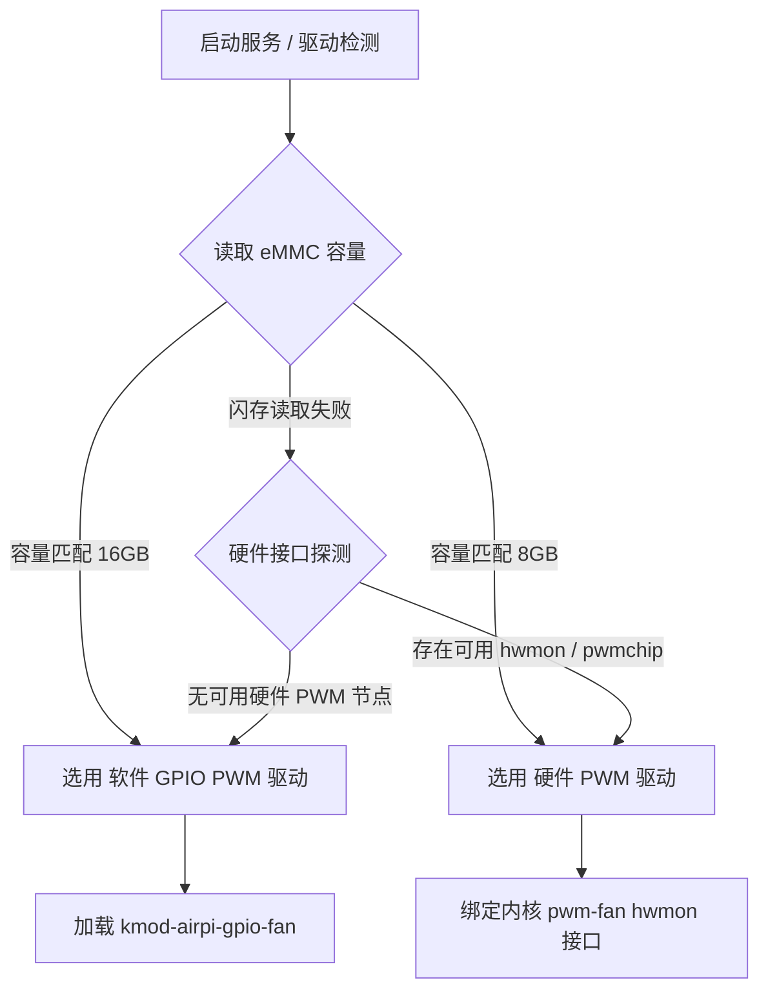

<div align="center">

# 🌀 luci-app-airpi3000m-fancontrol

**专为 Airpi AP3000M 打造的现代风扇控制插件 · LuCI 原生 JS 架构 + Rust 高性能温控守护进程**

[](https://github.com/LianXia233/luci-app-airpi3000m-fancontrol/actions/workflows/build.yml)
[-orange)](#)
[](#)
[-purple)](#)
[-red)](#)
[](LICENSE)

*支持 8G / 16G eMMC 闪存规格自动识别，集成硬件 PWM 与 GPIO 软 PWM 双驱动、多温区仲裁与无极调速*

---

</div>

> [!CAUTION]
> **专机专用硬件说明**：
> 本插件专为 **Airpi AP3000M 5G CPE**（`airpi,ap3000m`）定制开发，底层 GPIO 编号、PWM sysfs 路径与各温区传感器探测链路均严格匹配该设备，**请勿安装至其他路由器设备**。

---

## 📌 核心特性

- 🧠 **闪存驱动自适应识别**：根据 eMMC 容量自动决策驱动链路（`16GB` $\rightarrow$ 软 PWM；`8GB` $\rightarrow$ 硬件 PWM），亦支持 WebUI 手动强制切换。
- 🦀 **Rust 高性能温控守护**：底层由原生静态链接的 Rust 二进制程序 `airpi-fanctl` 驱动，零三方依赖、musl 静态链接，内存占用极低且安全可靠。
- 🌡️ **多源温度动态仲裁**：并行轮询采集 **CPU / Wi-Fi 芯片 / 物理层 PHY / 5G 蜂窝模组** 四路温度，以最高温区实时驱动风扇转速，异常值自动过滤回退。
- 🎛️ **丰富调速档位**：支持静音 (25%)、低速 (50%)、常规 (75%)、狂暴 (100%) 四档快捷预设、0~255 无极平滑滑块调速及阶梯智能温控。
- 🎨 **三列卡片式状态面板**：动态高亮最高温源，实时呈现驱动工作状态、eMMC 闪存信息与模拟 RPM 估算曲线。
- 🧩 **单页一体化界面 (v6.0.0+)**：状态座舱、硬件拓扑看板、实时 PWM 示波器与驱动参数表单全部合并在「状态 → 风扇控制」一页内，不再存在独立的「风扇设置」子菜单。
- ⚡ **现代 LuCI 架构 (v4.0+)**：基于 Client-Side JavaScript 现代视图架构，彻底剥离过时的 `luci-compat`，无缝兼容 OpenWrt 24.10、25.12 与 ImmortalWrt master 分支。

---

## 🖥️ 设备规格一览

| 硬件规格 | 详细参数 |
| :--- | :--- |
| **设备型号** | Airpi AP3000M 5G CPE |
| **主控芯片** | MediaTek MT7981B（双核 ARM Cortex-A53 @ 1.3GHz） |
| **OpenWrt 目标平台** | `mediatek/filogic` |
| **架构包格式** | `aarch64_cortex-a53` |
| **内存 / 存储** | 1GB DDR4 / 8GB 或 16GB eMMC |
| **散热系统** | PWM 控制散热风扇（无独立测速 Tach 引脚） |
| **设备树兼容标识** | `airpi,ap3000m`（OpenWrt 25.12+ 已内置原生支持） |

---

## ⚡ 快速安装

前往 [Releases 页面](https://github.com/LianXia233/luci-app-airpi3000m-fancontrol/releases) 下载对应固件版本的安装包：

### 方式 A：apk 系统 (OpenWrt 25.12.x / ImmortalWrt master 快照)

```sh
apk add --allow-untrusted ./luci-app-airpi-fancontrol-*.apk ./kmod-airpi-gpio-fan-*.apk

# 清除缓存并重载服务
rm -f /tmp/luci-indexcache*; rm -rf /tmp/luci-modulecache/
/etc/init.d/rpcd reload

```

### 方式 B：ipk 系统 (OpenWrt 24.10.x 及更早)

```sh
opkg install ./luci-app-airpi-fancontrol_*.ipk ./kmod-airpi-gpio-fan_*.ipk

# 清除缓存并重载服务
rm -f /tmp/luci-indexcache*; rm -rf /tmp/luci-modulecache/
/etc/init.d/rpcd reload

```

> [!NOTE]
> 安装完成后刷新浏览器缓存，在后台 **状态 → 风扇控制** 查看运行状态并调整驱动参数（状态座舱与硬件总线配置已合并到同一页面，v6.0.0 起不再有独立的「风扇设置」子菜单）。

---

## 🧭 驱动拓扑与硬件匹配机制

AP3000M 存在两款硬件版本，默认在「自动识别」模式下读取 `/sys/block/mmcblk0/size` 进行自适应配置：



| 硬件规格 | 驱动模式 | 底层接口 / 实现机制 |
| --- | --- | --- |
| **16GB eMMC** | **软件 GPIO PWM** | 主板未引出硬件 PWM 引脚，通过 `kmod-airpi-gpio-fan` 内核模块操作 GPIO 540 进行微秒级位翻转模拟 |
| **8GB eMMC** | **硬件 PWM** | 主板引脚已接入硬件控制器，挂载至内核 `pwm-fan`（hwmon）或 MT7981 导出的 `pwmchip` 节点 |

若需手动干预，可在 **状态 → 风扇控制** 页面下方的「风扇驱动与硬件配置」区覆盖自动判定。选择「软件 PWM (GPIO 软中断高精模块)」后才会展开可进一步配置的软 PWM 参数：

* **风扇 GPIO**：默认 `540`
* **模拟 PWM 周期**：默认 `15000` μs（周期过长易产生电磁啸叫，周期过短会略微增加软中断 CPU 负载）

---

## 🌡️ 智能温控曲线与多源仲裁

温控守护进程默认每 **8 秒** 轮询一次全部温度源，**自动选取其中的最高温源作为调速基准**：

### 1. 温控调速阶梯

| 触发条件（最高温度 $T$） | 占空比 | 输出比例 | 标称转速状态 |
| --- | --- | --- | --- |
| $T > 85^\circ\text{C}$ | `255 / 255` | 100% | 狂暴全速 |
| $60^\circ\text{C} < T \le 85^\circ\text{C}$ | `192 / 255` | 75% | 常规加速 |
| $50^\circ\text{C} < T \le 60^\circ\text{C}$ | `128 / 255` | 50% | 低速运转 |
| $T \le 50^\circ\text{C}$ | `64 / 255` | 25% | 静音巡航 |

### 2. 四路温度探测机制

| 温区来源 | 底层采集通道 | 过滤校验机制 |
| --- | --- | --- |
| **CPU 核心** | 遍历 `/sys/class/thermal/thermal_zone*/temp` | 仅采纳 $1 \sim 150^\circ\text{C}$ 之间有效读数，自动丢弃越界值 |
| **Wi-Fi 射频** | 首个匹配网卡（`ra0` / `rax0` / `rai0`）执行 `iwpriv <dev> stat` 提取 `CurrentTemperature` | 针对无线驱动异常回退机制 |
| **网络 PHY** | 遍历 `/sys/class/hwmon/hwmon*/temp1_input`（排除风扇类设备） | 取物理网卡传感器最大值 |
| **5G 模组** | `ubus call modem_ctrl info` 提取 `temperature` 字段 | 数值 $< 1000$ 视为摄氏度换算，否则按毫摄氏度换算 |

> [!NOTE]
> 界面显示的 RPM 为占空比线性换算值（$\text{RPM} = \text{Duty} \times 10$）。由于 AP3000M 硬件未引出风扇 Hall 测速引脚，无法直接回读物理转速。

---

## 🦀 Rust 温控守护进程 (`airpi-fanctl`)

自 v5.0.0 起，核心温控调度由 Rust 编写的独立程序 `/usr/bin/airpi-fanctl` 承载：

### 命令行子指令参考

```sh
airpi-fanctl daemon              # 启动温控守护前台主循环（交由 procd 托管）
airpi-fanctl status              # 查看转速、档位码、生效驱动与运行状态
airpi-fanctl temp                # 输出最高温度与对应来源标识
airpi-fanctl temps               # 列出当前所有可用的温度源键值
airpi-fanctl set <0-255> <0-3>   # 停止守护并固定转速与档位
airpi-fanctl auto                # 切回智能温控（写入档位码 9 并重启守护）
airpi-fanctl stepless <0-255>    # 无极自定义调速（写入档位码 999）
airpi-fanctl hwdetect            # 打印 eMMC 大小、软硬件驱动与 PWM 路径检测全貌

```

### 档位控制状态码（写入 `/etc/fanvall`）

| 档位码 | 工作模式 | 行为描述 |
| --- | --- | --- |
| `0` / `1` / `2` / `3` | 固定档位 | 对应占空比 `64` / `128` / `192` / `255`（静音 / 低速 / 常规 / 狂暴） |
| `9` | 智能温控 | 守护进程接管，根据温度曲线每 8 秒自动调速 |
| `999` | 无极调速 | 按用户在界面指定的任意占空比维持运行 |

---

## ⚙️ 配置文件与服务控制

UCI 配置文件位于 `/etc/config/airpi-fan`（升级插件保留）：

```uci
config fan 'settings'
    option fan_driver 'auto'      # auto (自动) | softpwm (软PWM) | pwm (硬PWM)
    option fan_gpio   '540'       # 软 PWM 使用的 GPIO 编号
    option fan_freq   '15000'     # 模拟周期 (微秒 μs)

```

### 服务管理命令

```sh
/etc/init.d/airpi-fancontrol start    # 启动守护进程
/etc/init.d/airpi-fancontrol stop     # 停止服务 (硬 PWM 回退至 64；软 PWM 归零停转)
/etc/init.d/airpi-fancontrol restart  # 重载配置并重启
/etc/init.d/airpi-fancontrol enable   # 设置开机自启

```

### 软 PWM 内核模块参数

```sh
# 手动加载内核模块示例
insmod airpi-gpio-fan.ko fangpio=540 cycle=255 period=15000 fanen=1

# 通过 sysfs 直接交互
echo 128 > /sys/kernel/duty_cycle    # 设置 50% 占空比
cat /sys/kernel/duty_cycle          # 读取当前占空比

```

---

## 🛠️ 深度技术解析与避坑指南

自 v4.0.0 起，`kmod-airpi-gpio-fan` 内核驱动采用**源码级自适应**，不再通过内核版本硬编码分支：

1. **GPIO 申请路径自适应**：
* Linux 6.17 引入了 `CONFIG_GPIOLIB_LEGACY`。若关闭该项，传统的 `gpio_request()` / `gpio_free()` 整数接口将不可用。
* 驱动通过 `IS_ENABLED(CONFIG_GPIOLIB_LEGACY)` 探测：开启时走传统整数路径；关闭时自动改走「描述符 + 查找表」路径（由全局 GPIO 编号推导控制器与 offset，经 `gpiod_add_lookup_table()` 绑定到驱动自带 platform device），无需修改设备树。


2. **高精度定时器**：
* 内核 6.15 移除了 `hrtimer_init()`，统一由 `hrtimer_setup()` 取代，源码中已通过预编译宏做平滑过渡。


在 AP3000M 实机（ImmortalWrt / 内核 6.18）上排查发现：**即使 vermagic 完全一致，模块依然可能被内核拒绝加载**，报错：

```text
.gnu.linkonce.this_module section size must match the kernel's built struct module size at run time

```

### 差异根源：Kconfig 配置改变了结构体大小与偏移

| 内核配置项 | 官方 SDK 默认 | 目标固件环境 | 对 struct module 的影响 |
| --- | --- | --- | --- |
| `CONFIG_MODULES_TREE_LOOKUP` | y | n | 结构体大小变化 **-384 字节** |
| `CONFIG_EVENT_TRACING` | y | n | 结构体大小变化 **-64 字节** |
| `CONFIG_DEBUG_INFO_BTF_MODULES` | y | n | 结构体大小变化 **-64 字节** |
| `CONFIG_BPF_EVENTS` | y | n | 总大小看似被对消，但导致 `exit` 字段后移 16 字节！ |

> [!WARNING]
> 最后一项尤其隐蔽：结构体大小总和完全一致，但由于 `mod->exit` 被内核偏移解析为 `NULL`，模块会被强制标为 `[permanent]`，表现为**可加载、可控速，但无法 `rmmod` 卸载**。
> **核验基准命令**：
> ```sh
> readelf -SW airpi-gpio-fan.ko | grep this_module   # 期望 size = 0x2c0 (704)
> readelf -rW airpi-gpio-fan.ko | grep this_module   # 期望恰好 2 个重定位项: 0x138 与 0x298
> 
> ```
> 
> 

---

## 🏗️ 编译指南

### 1. 通过 GitHub Actions 自动化编译

仓库已配置多环境流水线，推送标签即可触发构建：

```sh
git tag v5.0.0
git push origin v5.0.0

```

CI 将针对 **OpenWrt 24.10.x**、**OpenWrt 25.12.x** 以及 **ImmortalWrt master 快照** 同时发起矩阵构建。

### 2. 本地 SDK 编译

```sh
# 准备目标 SDK 并更新 feeds
./scripts/feeds update -a && ./scripts/feeds install -a

# 引入项目源码
git clone [https://github.com/LianXia233/luci-app-airpi3000m-fancontrol.git](https://github.com/LianXia233/luci-app-airpi3000m-fancontrol.git) /tmp/airpi
ln -s /tmp/airpi/luci-app-airpi-fancontrol package/luci-app-airpi-fancontrol
ln -s /tmp/airpi/airpi-gpio-fan            package/airpi-gpio-fan

# 配置目标包并执行编译
make defconfig
echo 'CONFIG_PACKAGE_luci-app-airpi-fancontrol=m' >> .config
echo 'CONFIG_PACKAGE_kmod-airpi-gpio-fan=m'       >> .config
make package/luci-app-airpi-fancontrol/compile V=s
make package/airpi-gpio-fan/compile V=s

```

> [!TIP]
> **跳过 SDK 内部 Rust 构建**：若已在宿主机使用 cargo 交叉编译好了 `airpi-fanctl`，可追加参数 `AIRPI_PREBUILT=1 AIRPI_PREBUILT_BIN=/path/to/airpi-fanctl` 快速打包。

---

## 📂 项目结构

```text
.
├── .github/workflows/build.yml        # CI 自动编译与发版工作流
├── airpi-gpio-fan/                    # GPIO 软 PWM 内核驱动
│   ├── Makefile                       # OpenWrt kmod 打包脚本
│   └── src/
│       ├── Makefile                   # Kbuild 定义
│       └── airpi-gpio-fan.c           # 驱动核心源码
├── luci-app-airpi-fancontrol/         # LuCI 现代前端与后端
│   ├── Makefile                       # OpenWrt package 构建规则
│   ├── src/                           # Rust 守护进程工程
│   │   ├── Cargo.toml                 # 零三方依赖 Cargo 配置
│   │   ├── Cargo.lock
│   │   └── src/main.rs                # airpi-fanctl 调度与多温区探测
│   ├── htdocs/luci-static/resources/view/airpi-fancontrol/
│   │   └── fancontrol.js              # 单页视图：状态座舱 + 硬件总线与驱动设置（v6.0.0 起合并）
│   └── files/                         # 系统运行资产
│       ├── etc/config/airpi-fan       # 默认 UCI 配置
│       ├── etc/init.d/airpi-fancontrol# procd 启动脚本
│       └── usr/bin/airpi-fanctl.sh    # rpcd/LuCI 桥接入口脚本
├── docs/                              # 界面预览资源
├── CHANGELOG.md                       # 版本迭代历史
└── LICENSE                            # GPL-2.0 开源授权

```

---

## 💖 致谢与开源协议

* 本项目基于 **Manper** 大佬的初始工作重构演进，在此基础之上完成了针对 AirPi AP3000M 的软硬件双模式适配、内核兼容性升级与 Rust 核心重构。
* 感谢开源社区所有无私奉献的开发者。
* 本项目遵循 [GPL-2.0-only](https://www.google.com/search?q=LICENSE&utm_source=gemini) 开源协议发布。
