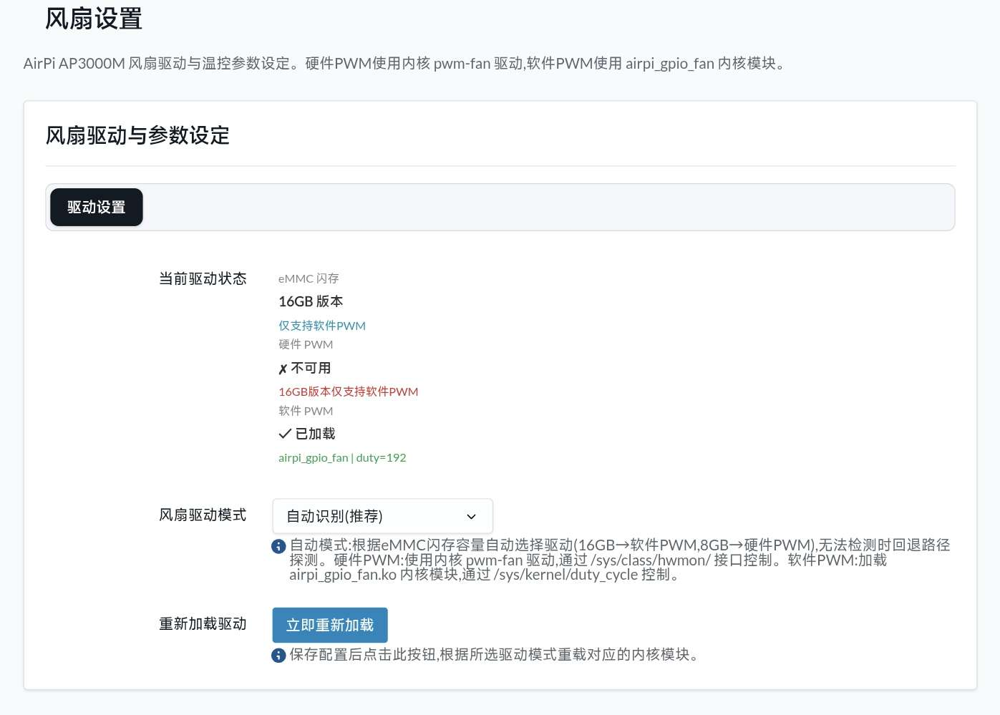

# luci-app-airpi3000m-fancontrol

Airpi AP3000M 专用的 OpenWrt 风扇控制插件，提供 LuCI 网页界面与温度自动调速守护进程。

[](https://github.com/LianXia233/luci-app-airpi3000m-fancontrol/actions/workflows/build.yml)
[](LICENSE)

> **本插件为 Airpi AP3000M 专用，已通过16G EMMC 软件PWM实机测试。8G EMMC硬件PWM的未知**
> GPIO 引脚编号、PWM sysfs 路径、温度传感器探测顺序均按该设备适配，装到别的路由器上不会工作。

> **v4.0.0 兼容性说明**：LuCI 前端已重写为 JS 版（Lua 版依赖的 `luci-compat` 已从 immortalwrt master 移除），同时兼容 OpenWrt 24.10（内核 6.6）与 immortalwrt master（内核 6.18）。每次 CI 构建都会使用 immortalwrt master 快照 SDK 实测编译，保证跟上最新内核。

---

## 设备信息

| 项目 | 参数 |
| --- | --- |
| 型号 | Airpi AP3000M 5G CPE |
| 主控 | MediaTek MT7981B（双核 ARM Cortex-A53） |
| OpenWrt 目标平台 | `mediatek/filogic` |
| 软件包架构 | `aarch64_cortex-a53` |
| 内存 / 存储 | 1GB DDR4 / 8GB 或 16GB eMMC |
| 散热 | PWM 控制风扇 |
| 设备树标识 | `airpi,ap3000m` |

OpenWrt 主线自 25.12 起已内置该设备支持。

---

## 功能特性

- **eMMC 容量自动识别**：通过闪存容量自动判断驱动模式（16GB→软件PWM，8GB→硬件PWM），无需手动选择
- **三列卡片式状态面板**：eMMC 闪存信息、硬件 PWM 状态、软件 PWM 状态一目了然，动态配色指示
- **双驱动支持**：自动识别模式下按 eMMC 容量自动选择，也可在网页端手动切换
  - **硬件 PWM**：8GB 版本使用内核 `pwm-fan`（hwmon）接口
  - **软件 PWM**：16GB 版本使用 `kmod-airpi-gpio-fan` GPIO 位翻转驱动
- **四档手动调速**：静音 25% / 低速 50% / 常速 75% / 全速 100%
- **无极调速**：滑块任意设定 0–255 占空比
- **智能温控**：按温度曲线自动调速
- **多温度源自动回退**：CPU / Wi-Fi / PHY / 模组 四路温度动态发现并取最大值驱动风扇，状态页卡片网格实时展示，最高温源青色高亮

---

## 界面预览

### 状态页（状态 → 风扇控制）

实时显示当前转速与驱动风扇的最高温度源读数，六档调速模式一键切换；底部温度条与温度卡片网格同步呈现 CPU / Wi-Fi / PHY / 模组 中可用的各路读数，最高温卡片青色高亮。

> 状态页显示的 RPM 为按占空比换算的估算值（占空比值 × 10）。AP3000M 风扇未引出测速引脚，无法读取真实转速。


### 设置页（状态 → 风扇设置）

展示 eMMC 闪存版本与软硬件 PWM 驱动加载状态（含当前占空比），可手动覆盖「自动识别」所选的驱动模式、调整风扇 GPIO 与模拟 PWM 周期，修改后需先「保存并应用」再点击 **重新加载驱动** 才会生效。



---

## 软件包组成

| 软件包 | 架构 | 说明 |
| --- | --- | --- |
| `luci-app-airpi-fancontrol` | `aarch64_cortex-a53` | LuCI 网页界面、Rust 温控守护进程、init 脚本 |
| `kmod-airpi-gpio-fan` | `aarch64_cortex-a53` | GPIO 软件 PWM 内核驱动（仅软 PWM 模式需要） |

依赖：`luci-base`、`kmod-hwmon-pwmfan`。硬件 PWM 使用固件提供的 `pwm-fan`（hwmon）接口或 MT7981 PWM 控制器直接导出的 pwmchip 节点；软件 PWM 需要单独安装 `kmod-airpi-gpio-fan`。

> v4.0.0 起前端为标准 JS 版 LuCI 应用（client-side view + rpcd exec 后端助手 `airpi-fanctl.sh`），不再需要 `luci-compat` / `luci-lua-runtime`。


---

## Rust 守护进程（airpi-fanctl）

v5.0.0 起，温控调速、温度采集、驱动选择与 PWM 写入等核心逻辑统一由 Rust 二进制 `airpi-fanctl` 承担，取代此前分散在 shell 脚本中的实现。安装后位于 `/usr/bin/airpi-fanctl`。

### 设计取舍

- **零第三方依赖**：`Cargo.toml` 不含 `[dependencies]` 段，全部代码仅用标准库。没有 crates.io 供应链风险，交叉编译时也不必处理依赖的移植性
- **静态链接 musl**：编译目标 `aarch64-unknown-linux-musl`，产物不依赖设备上的 libc 版本
- **面向嵌入式裁剪体积**：release profile 启用 `opt-level = "z"`（最小体积）、`lto = true`、`codegen-units = 1`、`panic = "abort"`（不生成栈展开表）、`strip = true`（剥离符号）
- **内置单元测试**：`main.rs` 含 `#[cfg(test)]` 模块，覆盖模组温度字段解析与参数范围校验

### 子命令

| 子命令 | 说明 |
| --- | --- |
| `daemon` | 温控守护主循环，由 init 脚本交给 procd 托管 |
| `status` | 输出转速、档位码、模式、生效驱动与守护状态 |
| `temp` | 输出最高温度 `temp=` 与来源标签 `source=` |
| `temps` | 以 `key=value` 列出全部可用温度源 |
| `set <转速> <档位>` | 手动档位，先停服务再写档位码与占空比（转速 0–255，档位 0–3） |
| `auto` | 切回智能温控，写档位码 9 并重启服务 |
| `stepless <转速>` | 无极调速，写档位码 999（转速 0–255） |
| `legacy-temp <-a\|-c\|-s>` | 兼容旧 `get_sys_temp.sh` 的调用形式 |
| `hwdetect` | 输出 eMMC 容量、硬件 PWM 路径、pwmchip、软 PWM 加载状态、当前占空比与生效驱动 |
| `reload` | 重启服务以重载驱动 |

档位码写入 `/etc/fanvall`，守护进程每轮循环据此判断运行方式：

| 档位码 | 含义 |
| --- | --- |
| `0` / `1` / `2` / `3` | 固定占空比 64 / 128 / 192 / 255（静音 / 低速 / 常规 / 狂暴） |
| `9` | 智能温控，按温度曲线循环调速 |
| `999` | 无极调速 |

> `tempsrc <cpu\|modem>` 会把温度源标签写入 `/etc/fanvallv.conf`，但该文件当前无任何代码读取，与 `fan_enable` 同属预留但未接线的配置项。

### 构建方式

**① 由 OpenWrt SDK 交叉编译（默认）**

需 feeds 中的 Rust 工具链：

```sh
./scripts/feeds update -a && ./scripts/feeds install -a
make package/luci-app-airpi-fancontrol/compile V=s
```

**② 打包外部预编译产物**

已在别处编译好 `airpi-fanctl` 时，可跳过 SDK 内的 Rust 构建直接打包：

```sh
make package/luci-app-airpi-fancontrol/compile V=s \
  AIRPI_PREBUILT=1 AIRPI_PREBUILT_BIN=/path/to/airpi-fanctl
```

CI 采用方式 ②：先用 rustup 配合 SDK 的交叉链接器编译，再以 `AIRPI_PREBUILT=1` 交给 SDK 打包。这样三个矩阵目标就不必各自从源码构建完整的 LLVM/Rust 宿主工具链。

### 本地开发

```sh
cd luci-app-airpi-fancontrol/src
cargo test    # 运行内置单元测试
```

交叉编译需先指定 SDK 里的链接器（CI 中即从 `staging_dir` 查找 `*-gcc` 写入 `.cargo/config.toml`）：

```sh
cargo build --locked --release --target aarch64-unknown-linux-musl
```

`src/.gitignore` 已忽略 `target/`，构建产物不会入库。

### 兼容入口

LuCI 前端并不直接调用 Rust 二进制——rpcd ACL 仅授权执行 `/usr/bin/airpi-fanctl.sh`，因此保留两个 shell 包装：

| 入口 | 实际行为 |
| --- | --- |
| `/usr/bin/airpi-fanctl.sh` | `exec /usr/bin/airpi-fanctl "$@"` |
| `/usr/bin/get_sys_temp.sh` | `exec /usr/bin/airpi-fanctl legacy-temp "$1"`，仅接受 `-a` / `-c` / `-s` |

这样既满足 rpcd 的授权粒度，也让既有脚本与命令行习惯无需迁移。
---

## 安装

前往 [Releases](https://github.com/LianXia233/luci-app-airpi3000m-fancontrol/releases) 页面下载对应格式的安装包。

| 固件版本 | 包格式 | 包管理器 |
| --- | --- | --- |
| ImmortalWrt master 快照（内核 6.18） | `.apk`（immortalwrt-master 构建产物） | `apk` |
| OpenWrt 25.12.x 及更新 | `.apk` | `apk` |
| OpenWrt 24.10.x 及更早 | `.ipk` | `opkg` |

```sh
# OpenWrt 25.12 及以上
apk add --allow-untrusted ./luci-app-airpi-fancontrol-*.apk ./kmod-airpi-gpio-fan-*.apk

# OpenWrt 24.10 及以下
opkg install ./luci-app-airpi-fancontrol_*.ipk ./kmod-airpi-gpio-fan_*.ipk
```

安装完成后刷新浏览器缓存，在 **状态 → 风扇控制** 查看运行状态，在 **状态 → 风扇设置** 调整驱动参数。

> **内核模块不再强制匹配内核版本。** 自 v4.1.0 起，`kmod-airpi-gpio-fan` 已删除包管理器层面的 `kernel (=版本)` 硬依赖（Makefile 中 `EXTRA_DEPENDS` 已清空），opkg/apk 不再因内核版本号不同而拒绝安装。但模块仍带有 vermagic，加载时由 `kmodloader` 校验，请使用与本机内核 vermagic 一致的构建产物（CI 已用 immortalwrt master 快照实测）。若只使用硬件 PWM 模式，可以不装这个内核模块。

---

## 使用说明

### 选择风扇驱动

AP3000M 有两个硬件版本，闪存容量不同，支持的 PWM 方式也不同。默认的「自动识别」模式通过读取 `/sys/block/mmcblk0/size` 判断 eMMC 容量来自动选择：

| eMMC 容量 | 自动选择的驱动 | 说明 |
| --- | --- | --- |
| 16GB | 软件 PWM | 16GB 版本未引出硬件 PWM 引脚，仅支持 GPIO 软件 PWM |
| 8GB | 硬件 PWM | 8GB 版本已连接 `pwm-fan` hwmon 接口 |

若 `/sys/block/mmcblk0/size` 读取失败，则按硬件 PWM 接口探测结果回退：探测到可写接口走硬件 PWM，否则退回软件 PWM。硬件 PWM 接口按以下顺序探测，取第一个可写者：

1. `/sys/class/hwmon/hwmon*/pwm1`（`name` 为 `pwmfan` 或 `pwm-fan`）
2. `/sys/class/pwm/pwmchip*/pwm*/duty_cycle`（MT7981 内置 PWM 控制器直接导出，沿用 0–255 占空比语义）

也可在 **状态 → 风扇设置** 中手动覆盖自动选择。选择软 PWM 后可继续配置：

| 配置项 | 默认值 | 说明 |
| --- | --- | --- |
| 风扇 GPIO | `540` | 驱动风扇的 GPIO 编号 |
| 模拟 PWM 周期(μs) | `15000` | 周期越大越容易啸叫，越小 CPU 占用越高 |

修改参数后需先「保存并应用」，再点击 **重新加载驱动** 卸载并重新加载驱动才会生效。

### 调速模式

| 模式 | 占空比 | 说明 |
| --- | --- | --- |
| 静音 | 64 / 255（约 25%） | 最低转速 |
| 低速 | 128 / 255（约 50%） | |
| 常规 | 192 / 255（约 75%） | |
| 狂暴 | 255 / 255（100%） | |
| 无极 | 0–255 任意 | 滑块自定义 |
| 智能 | 自动 | 按下方温度曲线自动调节 |

### 智能温控曲线

Rust 守护进程 `airpi-fanctl daemon` 每 8 秒采样一次温度，按下表调整占空比：

判定为严格大于阈值，实际区间如下：

| 温度区间（°C） | 占空比 | 约合转速 |
| --- | --- | --- |
| > 85 | 255 | 100% |
| > 60 且 ≤ 85 | 192 | 75% |
| > 50 且 ≤ 60 | 128 | 50% |
| ≤ 50 | 64 | 25% |

### 温度来源

`airpi-fanctl daemon` 每 8 秒同时采集以下多路温度，取最大值调速：

| 来源 | 采集方式 |
| --- | --- |
| CPU | 遍历 `/sys/class/thermal/thermal_zone*/temp`，取全部 zone 中的最高值 |
| Wi-Fi 芯片 | 对 `ra0` / `rax0` / `rai0` 中**首个存在**的接口执行 `iwpriv <dev> stat`，解析 `CurrentTemperature` |
| 网络 PHY | 遍历 `/sys/class/hwmon/hwmon*/temp1_input`，跳过 `pwmfan` / `pwm-fan` / `fan` 类设备，取最高值 |
| 模组 | `ubus call modem_ctrl info`，解析返回中的 `temperature` 字段 |

- 读数须落在 **1 – 150 °C** 区间内才被采纳，超出范围的异常值直接丢弃
- 模组温度字段小于 1000 时按摄氏度解析并换算为毫摄氏度，否则按毫摄氏度直接使用
- 同一来源存在多组读数时取最高值（例如多个 thermal zone、多个 hwmon）

状态页温度卡片网格以三列布局展示各可用来源读数，最高温卡片青色高亮。`get_sys_temp.sh -a`（等价于 `airpi-fanctl temps`）可命令行查看全部温度；`get_sys_temp.sh -s` 输出最高温的数值与来源标签。

---

## 配置文件

配置位于 `/etc/config/airpi-fan`：

```
config fan 'settings'
	option fan_driver 'auto'      # auto | softpwm | pwm
	option fan_gpio   '540'       # 软 PWM 使用的 GPIO 编号
	option fan_freq   '15000'     # 软 PWM 周期，单位微秒
	option fan_enable '1'         # 风扇总开关（当前版本未被代码读取，保留占位）
```

该文件已登记为 conffile，升级插件时不会被覆盖。

### 服务管理

```sh
/etc/init.d/airpi-fancontrol start     # 启动
/etc/init.d/airpi-fancontrol stop      # 停止（硬件 PWM 降至 64；软件 PWM 写 0 停转）
/etc/init.d/airpi-fancontrol restart   # 重启
/etc/init.d/airpi-fancontrol enable    # 开机自启
```

### 内核模块参数

```sh
insmod airpi-gpio-fan.ko fangpio=540 cycle=255 period=15000 fanen=1
```

| 参数 | 默认值 | 说明 |
| --- | --- | --- |
| `fangpio` | 540 | 输出 PWM 的 GPIO 编号 |
| `cycle` | 255 | 占空比最大值 |
| `period` | 15000 | PWM 周期（微秒） |
| `fanen` | 1 | 1 = 启用，0 = 强制输出低电平 |

加载后通过 `/sys/kernel/duty_cycle` 直接控制转速：

```sh
echo 128 > /sys/kernel/duty_cycle    # 设为 50%
cat /sys/kernel/duty_cycle           # 读取当前值
```

---

## 自行编译

### 通过 GitHub Actions

推送 `v` 开头的 tag 即自动编译并发布：

```sh
git tag v4.1.0
git push origin v4.1.0
```

CI 会同时用 OpenWrt 24.10.8、OpenWrt 25.12.5 与 ImmortalWrt master 快照 SDK 编译三个目标，其中 ImmortalWrt master 目标用于持续验证最新内核（当前 6.18）下的可编译性。

也可在 Actions 页面手动运行 **编译与发布**，填入发布标签即可创建 Release；留空则仅上传构建产物。

### 通过 OpenWrt SDK 本地编译

> LuCI 包内含 Rust 编写的守护进程，构建方式见 [Rust 守护进程（airpi-fanctl）](#rust-守护进程airpi-fanctl)。

```sh
# 以 25.12.5 filogic SDK 为例
wget https://downloads.openwrt.org/releases/25.12.5/targets/mediatek/filogic/openwrt-sdk-25.12.5-mediatek-filogic_gcc-14.3.0_musl.Linux-x86_64.tar.zst
tar --zstd -xf openwrt-sdk-*.tar.zst && cd openwrt-sdk-*/

./scripts/feeds update -a && ./scripts/feeds install -a

git clone https://github.com/LianXia233/luci-app-airpi3000m-fancontrol.git /tmp/airpi
ln -s /tmp/airpi/luci-app-airpi-fancontrol package/luci-app-airpi-fancontrol
ln -s /tmp/airpi/airpi-gpio-fan            package/airpi-gpio-fan

make defconfig
echo 'CONFIG_PACKAGE_luci-app-airpi-fancontrol=m' >> .config
echo 'CONFIG_PACKAGE_kmod-airpi-gpio-fan=m'       >> .config
make defconfig

make package/luci-app-airpi-fancontrol/compile V=s
make package/airpi-gpio-fan/compile V=s
```

产物位于 `bin/packages/aarch64_cortex-a53/base/` 与 `bin/targets/mediatek/filogic/packages/`。

### 并入固件源码树编译

将两个包目录复制到源码树的 `package/` 下，然后在 `make menuconfig` 中勾选：

- `LuCI → 3. Applications → luci-app-airpi-fancontrol`
- `Kernel modules → Other modules → kmod-airpi-gpio-fan`

---

## 常见问题

**「模拟PWM内核未加载」一直是红色**

说明 `airpi-gpio-fan.ko` 没有成功 insmod。依次检查：

```sh
lsmod | grep -i airpi              # 是否已加载
logread | grep airpi_gpio_fan      # 查看驱动日志
ls /sys/kernel/duty_cycle          # sysfs 节点是否存在
```

最常见的原因是内核模块与当前内核版本不匹配，重新下载对应固件版本的包即可。

**风扇有啸叫声**

软 PWM 模式下适当调低「模拟 PWM 周期」，或改用硬件 PWM 驱动。

**温度一直显示 null**

说明所有温度源都读不到有效值。注意只有落在 **1 – 150 °C** 区间的读数才会被采纳，返回 0、负数或明显超量程的传感器会被直接忽略。手动执行 `/usr/bin/get_sys_temp.sh -s` 查看最高温的数值与来源标签，或 `get_sys_temp.sh -a` 列出全部可用来源进行排查。

**风扇不转 / 一直全速**

先使用默认的「自动识别」模式。若手动指定驱动，确认硬件 PWM 模式存在 `pwm-fan` hwmon 接口，软件 PWM 模式则需要成功加载 `airpi-gpio-fan.ko`。

---

## 目录结构

```
.
├── .github/workflows/build.yml       自动编译与发布流程
├── airpi-gpio-fan/                   GPIO 软 PWM 内核驱动
│   ├── Makefile                      OpenWrt 内核模块打包定义
│   └── src/
│       ├── Makefile                  Kbuild 编译定义
│       └── airpi-gpio-fan.c          驱动源码
├── luci-app-airpi-fancontrol/        LuCI 应用(JS 版)
│   ├── Makefile                      OpenWrt 软件包定义
│   ├── src/                          Rust 守护进程源码
│   │   ├── Cargo.toml                构建定义（无第三方 crate 依赖）
│   │   ├── Cargo.lock                依赖锁定
│   │   └── src/main.rs               airpi-fanctl 实现
│   ├── htdocs/luci-static/resources/view/airpi-fancontrol/
│   │   ├── fancontrol.js             风扇控制台视图(状态页)
│   │   └── settings.js               风扇设置视图
│   └── files/
│       ├── etc/config/airpi-fan      UCI 配置
│       ├── etc/init.d/airpi-fancontrol  服务脚本
│       └── usr/
│           ├── bin/airpi-fanctl      Rust 控制工具与温控守护进程
│           ├── bin/airpi-fanctl.sh   LuCI/rpcd 兼容入口
│           ├── bin/get_sys_temp.sh   旧命令兼容入口
│           ├── share/luci/menu.d/    LuCI 菜单注册
│           └── share/rpcd/acl.d/     RPCD 访问控制声明
├── docs/                             界面预览图
│   ├── preview-fancontrol.png        风扇控制状态页截图
│   └── preview-fan-settings.png      风扇设置页截图
├── CHANGELOG.md                      更新日志
└── LICENSE                           GPL-2.0
```

---

## 许可证

本项目采用 [GPL-2.0-only](LICENSE) 许可证。
